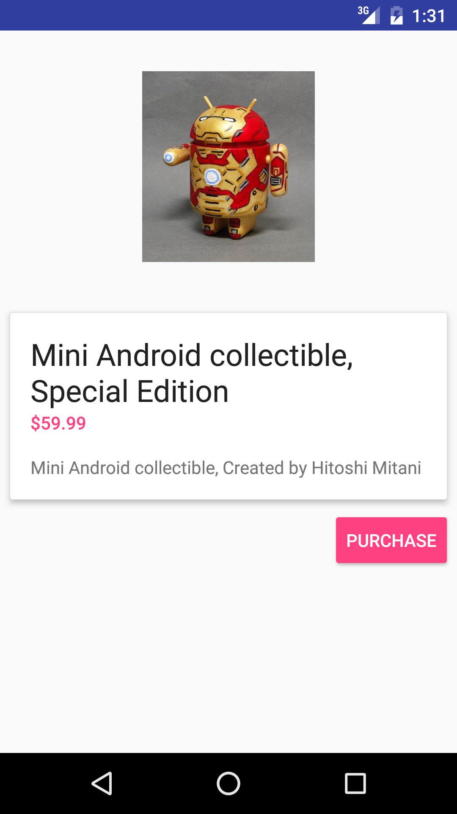
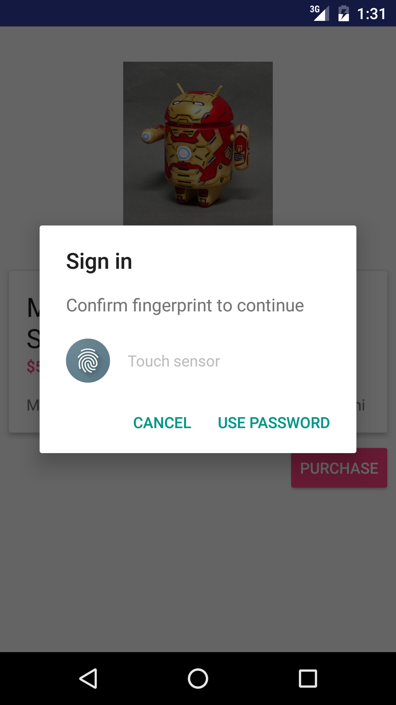
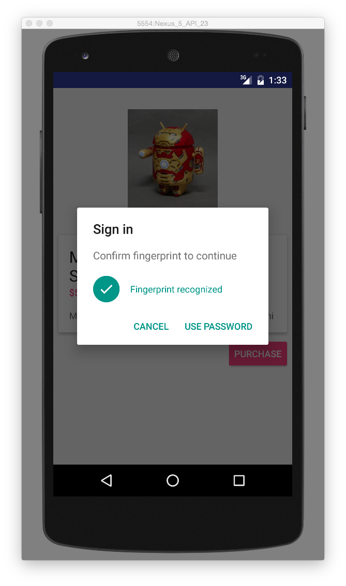
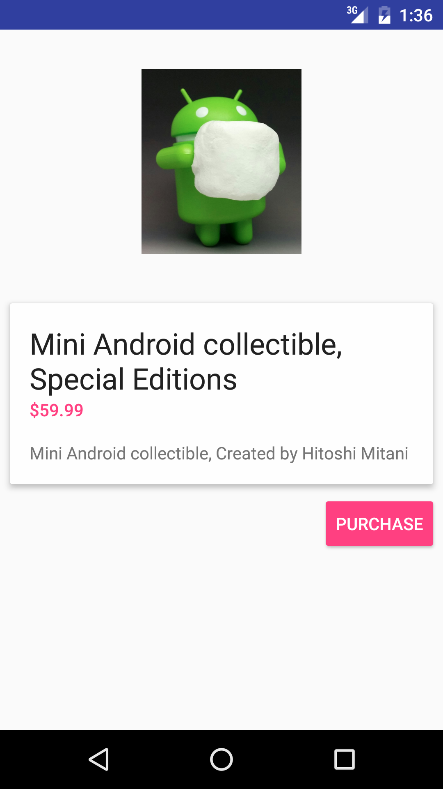
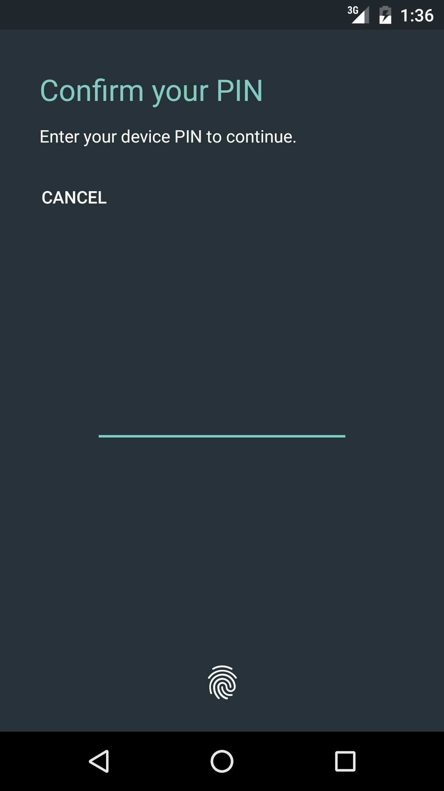
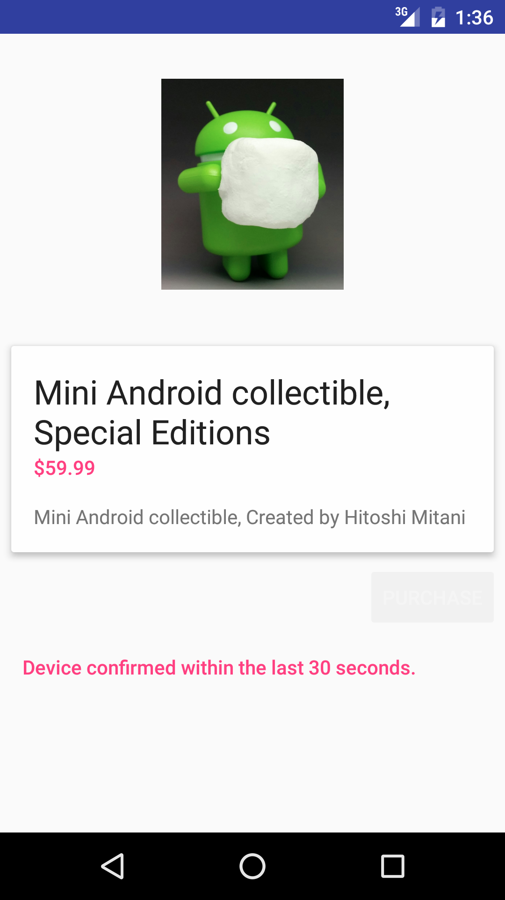
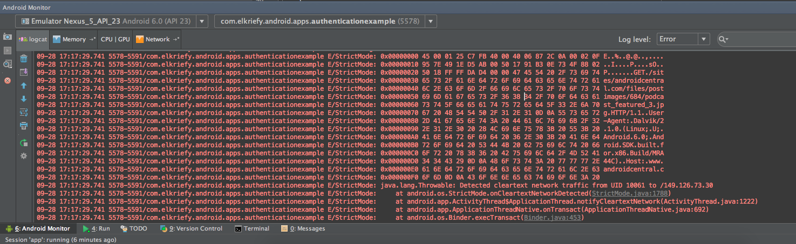

# AuthenticationExample 

This is a sample project using Android Marshmallow API to showcase a few features:

* [Fingerprint][1] API.

* [Credentials Grace period][2] abilities
* [usesCleartextTraffic][3] Flag

  The application uses  example projects by Google according to references

[1]: https://github.com/googlesamples/android-FingerprintDialog
[2]: https://github.com/googlesamples/android-ConfirmCredential
[3]: http://developer.android.com/guide/topics/manifest/application-element.html#usesCleartextTraffic

Fingerprint API Screenshots
-------------
 

 

Credentials Grace period Screenshots
-------------
 

 

ClearTextTraffic Network Screnshots
-------------
 

 

Getting Started
---------------

This sample uses the Gradle build system. To build this project, use the
"gradlew build" command or use "Import Project" in Android Studio.

Credits
---------------
Android images are subject and rights to **Hitoshi Mitani** and were taken from 
http://keropuni.blogspot.co.il/
